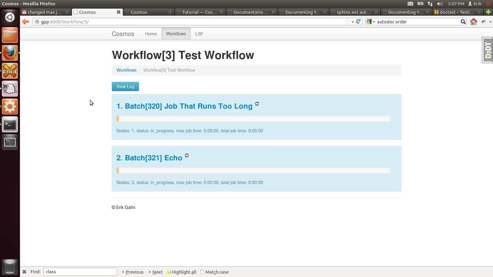

Getting Started
===============

We'll start by running a simple test workflow, exploring it via the web interface, and terminating.  Then
you'll be ready to start your own.

Command Line Interface
______________________

Make sure your environment variables, are set.  In particular :file:`/path/to/Cosmos/bin` must be in your PATH
Use the shell command :command:`env` if you're not sure what's in your environment.

.. code-block:: bash

   $ cosmos -h
   usage: cli.py [-h] {adm,wf} ...
   
   positional arguments:
     {adm,wf}
       adm       Admin
       wf        Workflow
   
   optional arguments:
     -h, --help  show this help message and exit
         
Explore the available commands, using -h if you wish.  Or see the :doc:`cli` for more info.  Note that when
listing workflows, the number beside each Workflow inside brackets, `[#]`, is the ID of that object.

Execute the Test Workflow
_________________________
   
The console will generate a lot of output as the workflow runs.  This workflow tests out various
features of Cosmos.  Again, the number beside each object inside brackets, `[#]`, is the ID of that object.

.. code-block:: generic

   $ python /path/to/cosmos/my_workflows/testflow.py
   
   INFO: 2012-09-27 16:47:08: Deleting directory /nas/erik/cosmos_out/Test_Workflow
   INFO: 2012-09-27 16:47:30: Created Workflow Workflow[3] Test Workflow.
   INFO: 2012-09-27 16:47:31: Restarting this Workflow.
   INFO: 2012-09-27 16:47:31: Adding batch Job_That_Runs_Too_Long.
   INFO: 2012-09-27 16:47:31: Creating Batch[352] Job That Runs Too Long from scratch.
   INFO: 2012-09-27 16:47:31: Created node Node[7145] 1 from scratch
   INFO: 2012-09-27 16:47:31: Running batch Batch[352] Job That Runs Too Long.
   INFO: 2012-09-27 16:47:31: Running Node[7145] 1 from Batch[352] Job That Runs Too Long
   INFO: 2012-09-27 16:47:32: Submitted jobAttempt with drmaa jobid 14173
   INFO: 2012-09-27 16:47:32: Adding batch Echo.
   INFO: 2012-09-27 16:47:35: Creating Batch[353] Echo from scratch.
   INFO: 2012-09-27 16:47:35: Created node Node[7146] 1 from scratch
   INFO: 2012-09-27 16:47:35: Created node Node[7147] 2 from scratch
   INFO: 2012-09-27 16:47:35: Created node Node[7148] 3 from scratch
   INFO: 2012-09-27 16:47:35: Running batch Batch[353] Echo.
   INFO: 2012-09-27 16:47:35: Running Node[7146] 1 from Batch[353] Echo
   INFO: 2012-09-27 16:47:36: Submitted jobAttempt with drmaa jobid 14174
   INFO: 2012-09-27 16:47:36: Running Node[7147] 2 from Batch[353] Echo
   INFO: 2012-09-27 16:47:40: Submitted jobAttempt with drmaa jobid 14175
   INFO: 2012-09-27 16:47:40: Running Node[7148] 3 from Batch[353] Echo
   INFO: 2012-09-27 16:47:41: Submitted jobAttempt with drmaa jobid 14176
   INFO: 2012-09-27 16:47:41: Waiting on batch Batch[353] Echo...

Launch the Web Interface
________________________

You can use the web interface to explore the history and debug all workflows.  To start it, run:

.. code-block:: bash

   cosmos adm runweb -p 8080
  

.. note:: Currently the system you're running the web interface on must be the same you're running the workflow on.
   
Visit http://your-ip:8080 to access it.  If you can't access the website, its likely firewalled off.  Fortunately, the Cosmos website
works well with lynx.  Use the command: :command:`$ lynx 0.0.0.0:8080` 

Terminating a Workflow
______________________

Currently, we do not support pressing ctrl+c (coming soon!) to terminate a workflow.  *Avoid pressing ctrl+c while a workflow is running*
If you do, Cosmos will not be able to properly update the database and things get out of sync.  It will be fine when you restart or resume
the workflow, but for example, your latest batch will still have the status of "in_progress" instead of "failed".  If you did not terminate
gracefully, make sure there are no left over Cosmos jobs running before you start the next workflow, which would probably reuslt in file output
conflicts. 

To terminate a workflow properly, first find it's ID:

.. code-block:: bash

   #Get the ID of the workflow
   $ cosmos wf listcosmos wf list
   Workflow[3] Terminate Me
   Workflow[5] My other Workflow
   ...
   
Then, use the workflow's id to terminate it:

.. code-block:: bash

   $ cosmos wf terminate 1
   Telling Workflow[3] Terminate Me to terminate
   WARNING: 2012-09-27 17:01:14: Terminating this workflow...
   Request <14182> is being terminated
   ...
   
   

